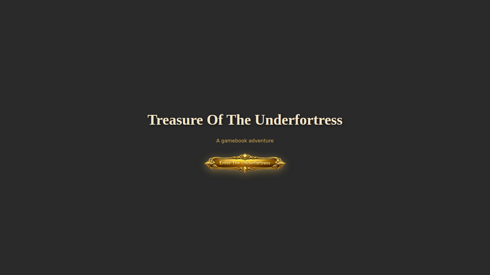
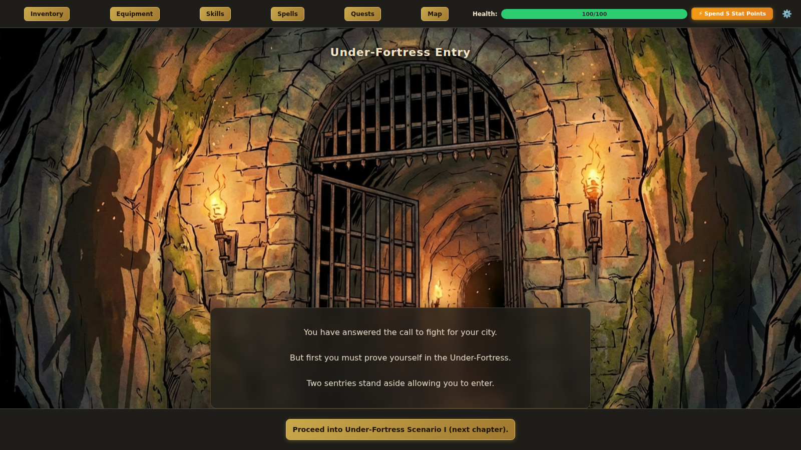
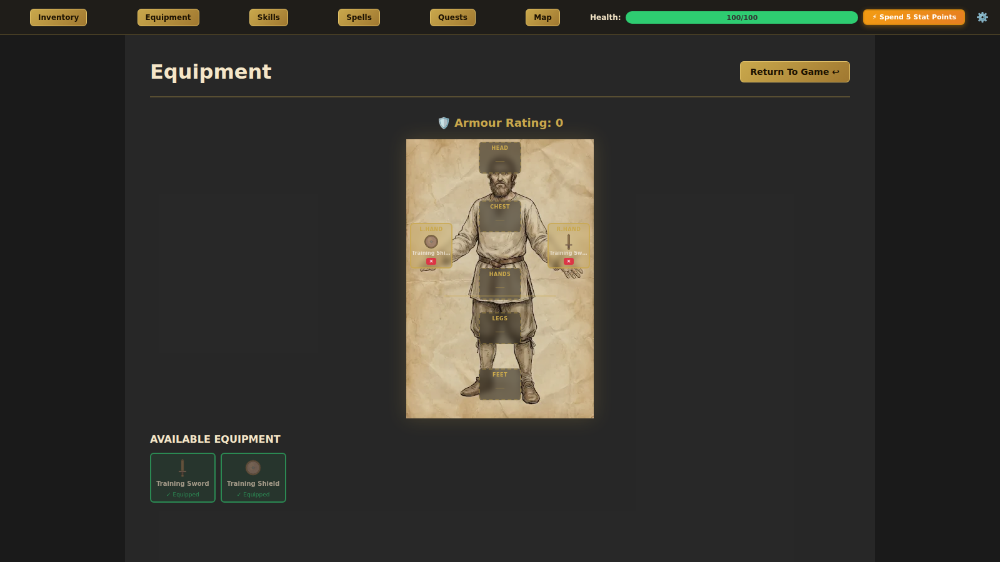
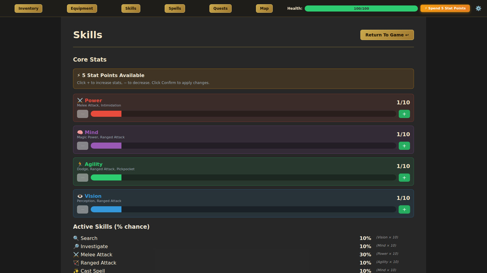
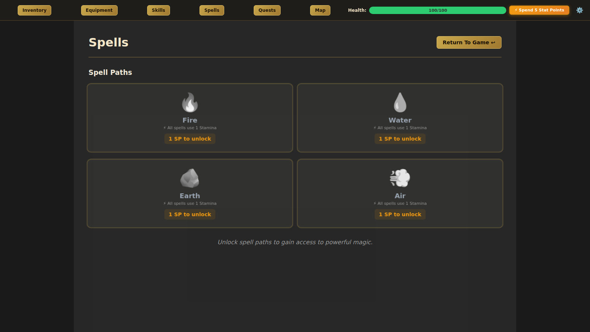

# Treasure Of The Underfortress

A data-driven, illustrated gamebook RPG built with **React**, **TypeScript**, and **Vite**. Inspired by classic Fighting Fantasy and interactive fiction, Underfortress presents a branching narrative set in a besieged fantasy city — complete with turn-based combat, spellcasting, quest systems, and a fog-of-war map.

## Project Status

Currently unfinished, only the first 20 or so areas have background images and have been tested. 

## Screenshots

### Title Screen



### Gameplay



### Equipment



### Skills



### Spells




Generate fresh screenshots automatically:

```bash
# Terminal 1
npm run dev

# Terminal 2
npx playwright install chromium
npm run screenshots
```

Output files are written to `screenshots/`.

## Features

- **Branching narrative engine** — Hundreds of interconnected areas with choices, skill checks, and consequences
- **Turn-based combat** — d100-based system with melee, ranged, magic attacks, and enemy AI
- **Character progression** — Four core stats (Power, Mind, Agility, Vision), skill trees, spells, and equipment
- **Quest & job system** — Multi-stage quests with flag-driven state tracking
- **Threat system** — Dynamic escalation mechanics that respond to player actions
- **Equipment & crafting** — Paper-doll equipment screen, item crafting via recipes
- **Fog-of-war map** — Grid-based map that reveals as the player explores
- **Content pipeline** — Modular JSON authoring with automated merge, deduplication, and validation tools

## Tech Stack

| Layer | Technology |
|-------|-----------|
| UI | React 18, TypeScript |
| State | Zustand |
| Validation | Zod schemas |
| Build | Vite 4 |
| Testing | Jest, ts-jest |

## Getting Started

### Prerequisites

- **Node.js** 18.x or later
- **npm** 9.x+

### Install & Run

```bash
# Clone the repository
git clone https://github.com/markhorne1/underfortress.git
cd underfortress

# Install dependencies
npm install

# Merge content fragments into canonical JSON masters
node tools/mergeContent.js

# Validate content wiring (area exits, item refs, quest completeness)
node tools/validateContent.js

# Start the development server
npm run dev
# → Open http://localhost:5173
```

### Build for Production

```bash
npm run build
# Output: dist/
```

### Build a Windows `.exe` (Installer + Portable)

Underfortress can be packaged as a desktop app using Electron.

```bash
# Install dependencies (already done once per clone)
npm install

# Optional: run as desktop app in development
npm run electron:dev

# Build web assets and create Windows packages
npm run dist:win
```

Packaging output goes to `release/` and includes:

- NSIS installer (`.exe`)
- Portable executable (`.exe`)

Notes:

- Building Windows artifacts is most reliable on Windows (or CI with a Windows runner).
- Unsigned `.exe` files may show SmartScreen warnings.

### Build Windows `.exe` via GitHub Actions (Codespaces-friendly)

This repository includes a workflow at `.github/workflows/windows-exe.yml` that builds on `windows-latest` and uploads downloadable `.exe` artifacts.

How to use:

```bash
# Commit and push your changes
git add .
git commit -m "Add/Update game changes"
git push
```

Then in GitHub:

1. Open **Actions**
2. Select **Build Windows EXE**
3. Run workflow (or use the latest run from `main` push)
4. Download artifact: `underfortress-windows-exe`

The artifact contains the NSIS installer `.exe` and portable `.exe` from `release/`.

### Run Tests

```bash
npm test
```

## Troubleshooting (Codespaces ENOPRO)

If command execution intermittently fails with provider errors, run commands
through the Python retry wrapper:

```bash
python3 tools/enopro_workaround.py --cwd /workspaces/underfortress -- npm run build
```

VS Code task is also included:

1. Run task: **Run Command (Python ENOPRO Workaround)**
2. Enter the command you want to execute

## Project Structure

```
underfortress/
├── content/          # Game content (JSON fragments + canonical masters)
│   ├── areas*.json   # Area/location definitions (per-act fragments)
│   ├── enemies*.json # Enemy configurations
│   ├── items*.json   # Items, weapons, armour
│   ├── quests*.json  # Quest definitions and wiring
│   ├── spells*.json  # Spell definitions
│   └── ...           # NPCs, jobs, recipes, endings, shops
├── docs/             # Design and architecture documents
├── public/icons/     # SVG icons (equipment, UI elements)
├── src/
│   ├── engine/       # Core game engine (TypeScript)
│   │   ├── combat.ts / combatNew.ts  # Turn-based combat system
│   │   ├── contentLoader.ts          # JSON content loading & caching
│   │   ├── effects.ts                # Effect execution (items, flags, XP)
│   │   ├── execute.ts                # Choice/action orchestrator
│   │   ├── requirements.ts           # Prerequisite evaluation
│   │   ├── quests.ts                 # Quest state machine
│   │   ├── schemas.ts                # Zod validation schemas
│   │   ├── threat.ts                 # Threat escalation system
│   │   └── types.ts                  # Shared type definitions
│   ├── components/   # React UI components
│   ├── screens/      # Game screens (title, menu, game, map, inventory, etc.)
│   ├── store/        # Zustand state stores
│   ├── storage/      # Save/load persistence layer
│   └── utils/        # Utilities
├── tools/            # Content pipeline tooling
│   ├── mergeContent.js        # Merge JSON fragments → canonical masters
│   ├── validateContent.js     # Cross-reference validator
│   └── generateAutowire*.js   # Quest wiring helpers
├── index.html        # App entry point
├── vite.config.ts    # Vite configuration
└── tsconfig.json     # TypeScript configuration
```

## Content Pipeline

Game content is authored as modular JSON fragments (one per story arc/act) and merged into canonical master files consumed by the engine at runtime.

```bash
# Merge all fragments → content/areas.json, items.json, enemies.json, etc.
node tools/mergeContent.js

# Validate: checks area exits, item references, quest wiring integrity
node tools/validateContent.js
```

The validator enforces that every area exit, item reference, and quest trigger resolves correctly — broken content is caught before it reaches the player.

## Architecture

The engine follows a straightforward data-driven loop:

1. **Load** an area → display description, illustration prompt, and available actions
2. **Evaluate** requirements (items, flags, spells, stats) to determine what the player can do
3. **Execute** effects (add/remove items, set flags, grant XP, initiate combat, advance quests)
4. **Navigate** to the next area via exits or choices

Key design decisions:

- **Separation of content and code** — All narrative content lives in JSON; the engine is content-agnostic
- **Schema validation** — Zod schemas enforce content structure at load time
- **Deterministic merge** — Content fragments are merged in sorted file order with last-write-wins deduplication

## Documentation

Detailed design and architecture documents are in the [docs/](docs/) directory:

- [Combat Architecture](docs/COMBAT_ARCHITECTURE.md) — Combat system design
- [Design Notes](docs/DESIGN_NOTES.md) — Index of internal design documents

## License

All rights reserved. This project is shared for portfolio review purposes.


